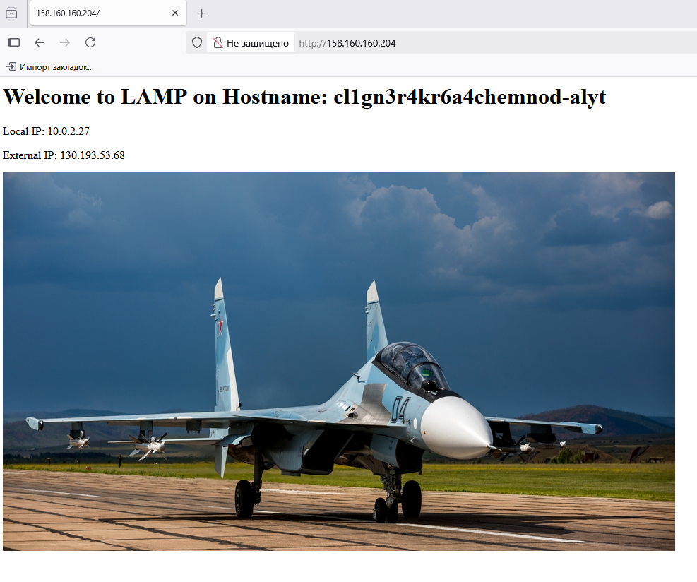

# Домашнее задание к занятию «`Вычислительные мощности. Балансировщики нагрузки`» - `Дедюрин Денис`

---
## Задание 1. Yandex Cloud

1. Создать бакет Object Storage и разместить в нём файл с картинкой:

 - Создать бакет в Object Storage с произвольным именем (например, _имя_студента_дата_).
 - Положить в бакет файл с картинкой.
 - Сделать файл доступным из интернета.

2. Создать группу ВМ в public подсети фиксированного размера с шаблоном LAMP и веб-страницей, содержащей ссылку на картинку из бакета:

 - Создать Instance Group с тремя ВМ и шаблоном LAMP. Для LAMP рекомендуется использовать `image_id = fd827b91d99psvq5fjit`.
 - Для создания стартовой веб-страницы рекомендуется использовать раздел `user_data` в [meta_data](https://cloud.yandex.ru/docs/compute/concepts/vm-metadata).
 - Разместить в стартовой веб-странице шаблонной ВМ ссылку на картинку из бакета.
 - Настроить проверку состояния ВМ.

3. Подключить группу к сетевому балансировщику:

 - Создать сетевой балансировщик.
 - Проверить работоспособность, удалив одну или несколько ВМ.

4. (дополнительно)* Создать Application Load Balancer с использованием Instance group и проверкой состояния.

### Ответ:

Все исходники лежат в папке **src** текущего репозитория.

1. После создания инфраструктуры, проверяем созданный бакет с загруженной картинкой, группу виртуальных машин и балансировщик:

 скрин созданного бакета

 скрин ссылки на изображение

 скрин картинки

 скрин группы виртуальных машин

 скрин балансировщика

Переходим по адресу, который присвоился балансировщику и пытаемся обновить страницу, чтобы увидеть, что блансировщик переключает нагрузку на разные ВМ.

